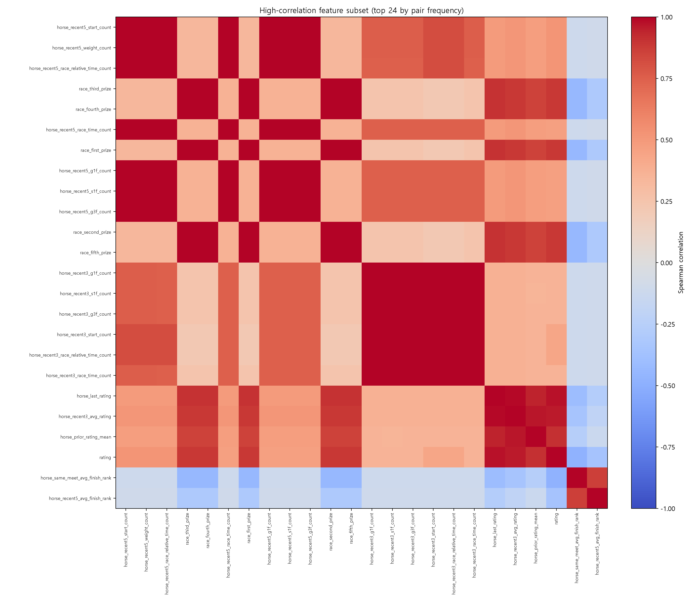
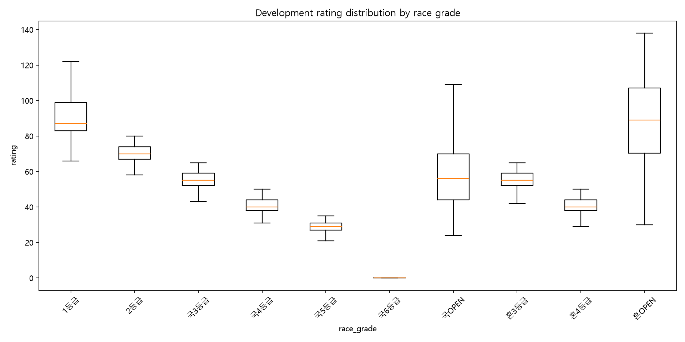

# PLC final Feature descriptive diagnostic

## 결론

LR1의 144개 입력은 봉인 계약과 일치하며 Development 28,392행·2,675경주에서 검사됐다.
결측과 값 범위에는 실행을 막는 오류가 없지만, count·상금·rating·성적 요약 family 안에는 강한
중복 구조가 있다. 이 결과만으로 Feature를 제거하지 않는다. 별도 사전 봉인 temporal ablation의
우선 조사 대상은 **완전 중복 count 묶음**, **고정 비율 상금 묶음**, **거의 항상 1인 finish-rate
묶음**, **희소한 고카디널리티 `race_type`**이다.

## 범위와 보호 계약

- 기간: `2023-01-01 <= race_date < 2024-07-01`; 실제 관측일 2023-01-06~2024-06-30
- 모집단: 28,392 runner rows, 2,675 races, 업무키 중복 0
- 입력: 수치형 133개 + 범주형 11개 = 144개
- LR1 hash: `7fec6229b3b355d34e664823407765c9a597eacdafa11a733048ba2eaff1a85a`
- 구성: baseline v2 117 + F1 6 + F3 10 + T1 4 + R1 7
- Validation 및 2024-07-01 이후 행은 조회하지 않았다. target은 봉인된 Logistic 계수의
  fold 안정성 재현에만 사용했으며 새로운 성능 지표나 후보 선택에는 사용하지 않았다.
- 공통 source DB와 branch-local experiment DB는 read-only였으며 실행 전후 SHA256이 동일했다.

전체 입력 이름·순서·type·bundle은 재현 산출물 `feature_contract.csv`에 보존했다.

## 분포 및 가용성

수치형 133개 중 완전 상수는 0개였고, 비결측 행의 99% 이상이 같은 값을 갖는 near-constant는
7개였다. 이 99%는 오류 판정선이 아니라 점검용 표시 기준이다.

| Feature 묶음 | 관측 결과 | 해석 |
|---|---:|---|
| `horse_recent3/5/10_finish_rate` | 최빈값 비율 99.04~99.59% | 정상 출전·완주 모집단에서 거의 항상 1이라 정보량이 작을 가능성 |
| same-distance / same-meet-distance finish rate | 최빈값 비율 약 99.25% | 조건 이력 결측은 25.7~26.2%이나 관측값 자체 변화는 매우 작음 |
| jockey/trainer recent10 start count | 최빈값 비율 99.47% / 99.87% | 대부분 window 상한에 도달해 장기 경력 차이를 거의 표현하지 않음 |

가장 큰 결측은 말×기수 동일 경마장 PLC rate 43.51%, 말×기수 recent10 PLC rate 43.04%,
same-distance/same-meet-distance 계열 약 25.7~26.7%, T1 4개 17.21%였다. 이 결측은
관계·조건별 과거 관측 부족과 최소 trend 관측수에서 생기는 예상된 sparsity이며 companion
count와 함께 해석해야 한다.

범주형 11개에는 결측이 없었다. `race_type`은 87개 category 중 `일반`이 95.59%를 차지하고
86개 category가 각각 1% 미만이라 가장 뚜렷한 고카디널리티·희소 category 구조를 보였다.
`race_prize_condition`도 20개 중 12개가 각각 1% 미만이었다.

## 상관과 구조적 중복

- |Pearson| ≥ 0.8: 241쌍
- |Spearman| ≥ 0.8: 229쌍
- |Spearman| ≥ 0.9: 116쌍, 연결 component 29개
- 값과 NULL pattern까지 완전히 같은 수치형 pair: 13쌍
- 완전 선형관계 pair: 27쌍(위 13쌍 포함)

완전 중복의 중심은 다음과 같다.

1. recent3에서 race-time, G3F, G1F, F1 race-relative valid count가 서로 동일했다.
2. recent5에서도 같은 네 count가 서로 동일했다.
3. `horse_recent5_start_count`와 `horse_recent5_weight_count`가 동일했다.
4. 1~5위 상금은 서로 완전 선형, bonus 1~3도 서로 완전 선형이었다.
5. same-distance finish rate와 same-meet-distance finish rate도 완전 선형이지만 값/NULL이
   완전히 같지는 않았다.

큰 Spearman component는 rating/평균 rating/상금(11개), recent5 count(7개), recent3 count
(6개), PLC·Top3·same-meet 성적(5개)이었다. 최근 평균 착순과 F1 상대 경주시간도 강하게
겹쳤다. recent5 기준 평균 착순 대 time percentile은 -0.926, 평균 착순 대 time advantage는
-0.910이었다.

이는 계산 오류가 아니라 현재 데이터에서 같은 유효 event population과 경주 조건을 여러
표현으로 담은 결과다. Logistic 계수의 부호와 크기는 이 공선성 아래에서 개별 Feature의
독립적인 인과효과로 읽을 수 없다.

## 범주형 관계

corrected Cramér's V가 0.8 이상인 pair는 `race_grade`–`race_prize_condition` 한 쌍(V=0.827)이었다.
그 밖에 race sex condition–race type 0.735, meet–요일 0.724, grade–weight condition 0.718로
상대적으로 높았다. 양방향 1:1 mapping인 범주 pair는 없었다. 따라서 강한 제약 관계는 있으나
범주형 Feature 중 하나가 다른 하나를 완전히 결정한다고 볼 수는 없다.

## rating과 등급

rating은 등급과 강하게 구조화돼 있다. 국6등급 8,610행은 rating 중앙값·IQR 모두 0이었고,
그 밖의 중앙값은 국5 29, 국4/혼4 40, 국3/혼3 55, 2등급 70, 1등급 87이었다. OPEN은 범위가
더 넓었다. 경마장별 rating 중앙값은 서울 33, 부산경남 30이었다.

따라서 절대 rating 계수는 등급·상금·과거 rating들과 분리해 단독 해석하면 안 된다. 반면
`rating`과 `rating_field_percentile`의 Spearman은 0.157로 낮아, field percentile은 같은 경주
안의 상대 위치라는 별도 정보를 표현한다.

## 주요 family 관계

| 관계 | Spearman / 가용성 | 판단 |
|---|---:|---|
| prior PLC rate ↔ recent5 PLC rate | 0.863 / 94.4% | 강하게 겹치지만 장기 수준과 최근 수준의 차이는 남음 |
| recent3 ↔ recent5 S1F | 0.938 / 94.4% | 매우 높은 중복 |
| recent3 ↔ recent5 G3F / G1F | 0.855 / 0.853 | 강한 중복이나 동일하지 않음 |
| F1 recent3 ↔ recent5 상대 경주시간 | 강한 양의 관계 | window 차이는 제한적이지만 서로 동일하지 않음 |
| 절대 horse PLC rate ↔ field percentile | 0.695~0.792 | 상대 위치가 추가 정보를 일부 유지 |
| jockey/trainer recent10 rate ↔ field percentile | 0.929 / 0.925 | 상당히 중복 |
| 절대 sectional ↔ field percentile | -0.766~-0.803 | 방향 전환된 field rank와 강하게 겹침 |
| count ↔ rate | horse 0.106~0.166, jockey 0.379, trainer 0.187 | 표본 신뢰도와 rate 수준은 대체로 별도 정보 |
| T1 trend ↔ 대응 recent5 level | -0.027~0.012 | trend는 level과 거의 선형·순위 중복이 없음 |

R1의 same-meet, same-meet-distance, 관계자 및 F1 field percentile도 원 absolute Feature와
중복 정도가 높지만 완전히 같지는 않다. 상세 수치와 non-null overlap은
`special_family_relationships.csv`에 기록했다.

## 표준화 Logistic 계수 안정성

기존 4개 expanding temporal fold 각각에서 동일 LR1 Logistic과 Train-only preprocessing을
재적합했다. 이 실행은 성능 평가가 아니라 수치형 계수의 방향 안정성 진단이다.

- 수치형 133개 중 86개가 4/4 fold에서 같은 부호였다.
- 절대 평균계수가 큰 항목은 `horse_last_rating` -1.241, `rating` +0.746,
  `horse_recent5_avg_rating` +0.634, `horse_prior_rating_mean` +0.480,
  `horse_prior_plc_hit_rate_field_percentile` +0.354였다.
- `horse_recent3_avg_rating`, prior start count, 일부 weight/rating summary와 일부 sectional trend는
  fold에 따라 부호가 바뀌었다.
- rating 계열의 큰 반대 부호는 높은 공선성 속 조건부 계수이며, “last rating이 나쁘다” 같은
  단변량 해석을 지지하지 않는다.

범주형은 one-hot category별 계수이므로 단일 표준화 부호로 요약하지 않았다. 대신 source
Feature별 category coefficient L2와 최대 절댓값을 별도 저장했다. `race_type`은 fold별 학습
category가 27~78개로 변해 가장 불안정한 vocabulary 구조였고, 그 다음은 race grade와 prize
condition이었다.

## Tree importance

현재 저장된 Development 산출물에는 LR1 144개 전체에 대한 재사용 가능한 tree importance가
없었다. 사용자 범위에 따라 새 tree를 학습하지 않았고 importance가 없는 사실만 기록했다.

## 단순화 후보와 판단 한계

다음은 **제거 결정이 아니라 후속 ablation 가설**이다.

1. 완전 동일한 recent3/recent5 유효 관측 count 중 대표 companion만 유지할 수 있는가?
2. 고정 비율인 1~5위 상금과 bonus 1~3을 더 적은 경주가치 표현으로 축약할 수 있는가?
3. near-constant finish rate 및 recent10 count가 시간외 일반화에 실질적으로 기여하는가?
4. 희소 category가 많은 `race_type`을 더 안정적인 사전 정의 범주로 묶을 근거가 있는가?
5. 높은 중복의 absolute와 field percentile을 둘 다 유지하는 편이 temporal loss에 유리한가?

상관은 중복 가능성을, 표준화 계수는 특정 공선성 구조 안의 조건부 관계를 보여줄 뿐이다.
둘 다 단독으로 Feature 삭제를 정당화하지 않는다. 필요하면 위 가설을 소수 family 단위로
사전 봉인하고 동일 Development temporal fold에서 ablation해야 한다.

## 재현 산출물

실행 명령은 `python -m kra_analytics.feature_diagnostics`다. 전체 행렬과 상세 CSV/JSON은
git-ignored `data/exports/diagnostics/plc_final_feature_diagnostic_v1/`에 저장한다.

- `feature_contract.csv`
- `numeric_profile.csv`, `categorical_profile.csv`
- `pearson_matrix.csv`, `spearman_matrix.csv`, `high_correlation_pairs.csv`
- `exact_or_perfect_linear_numeric_pairs.csv`, `spearman_components.csv`
- `categorical_associations.csv`, `numeric_categorical_group_summary.csv`
- `special_family_relationships.csv`
- `numeric_standardized_coefficients_by_fold.csv`, `numeric_coefficient_stability.csv`
- `categorical_onehot_coefficients_by_fold.csv`, `categorical_coefficient_stability.csv`
- `result.json`

## 확인된 사실 / 아직 검증되지 않은 것

확인된 사실은 Development 범위의 분포·결측·중복·association·fold 계수 방향이다. 아직 알 수
없는 것은 중복 Feature를 제거했을 때 손실이 좋아지는지, category 통합이 일반화를 높이는지,
같은 관계가 기존 노출 Validation이나 unopened post-2025-07 기간에도 유지되는지다. 이번
진단은 target 기반 선택, ablation, Validation 접근을 수행하지 않았다.
