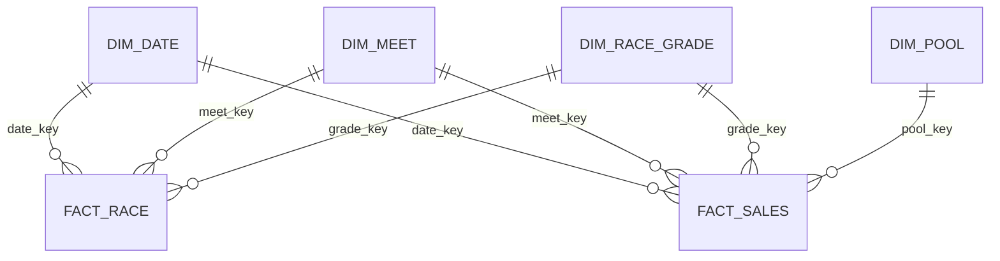

# 5B 사업성 분석용 Star Schema 설계

## 1. 목적과 범위

이 Star Schema는 예측 모델 학습이 아니라 KRA 경마 데이터의 시장 규모와 구조를
월, 경마장, 경주 등급, 승식별로 비교하기 위한 분석 계층이다.

- Canonical 원천: 경주 4,600건, 경주·승식 32,074건
- 시장 분석 모집단: 정상 완료이며 공식 7개 승식이 모두 존재하는 경주 4,582건
- 등급: 현재 관측된 10개 등급을 모두 유지
- 승식: 공식 7개 승식을 모두 유지
- 승식 후보는 이 단계에서 미리 지정하지 않고 분석 결과로 결정
- 매출은 시장 규모의 보조지표이며 수익성이나 모델 기대수익으로 해석하지 않음

## 2. 설계 원칙

1. Canonical은 수정하지 않고 `analytics` 스키마에 별도 테이블을 생성한다.
2. Fact의 한 행이 무엇인지 명확히 고정하고 서로 다른 Grain의 수치를 섞지 않는다.
3. 취소·결과 미확정·매출 누락 경주를 Fact에서 삭제하지 않고 상태와 포함 여부로 보존한다.
4. 시장 분석 Mart만 명시적인 완전성 조건을 통과한 4,582경주를 사용한다.
5. 원본 등급과 승식 명칭을 보존하면서 분석용 표준 코드를 별도로 제공한다.
6. 월별 비교를 기본으로 하되 원천 경주일자는 보존한다.
7. Power BI의 관계는 Dimension 1 대 Fact 다 관계와 단방향 필터를 기본으로 한다.

## 3. 관계 구조



두 Fact는 직접 관계를 만들지 않고 공통 Dimension을 공유하는 Fact Constellation으로 구성한다.
`race_id`는 두 Fact의 대사와 상세 조회에 사용하는 퇴화 차원이며 Power BI 필터 경로로
Fact끼리 연결하지 않는다. 이 구조는 양방향 관계와 모호한 필터 경로를 피한다.

## 4. Dimension 설계

### 4.1 `analytics.dim_date`

Grain: 달력 날짜 1일당 한 행.

| 컬럼 | 형식 | 설명 |
|---|---|---|
| `date_key` | INTEGER PK | `YYYYMMDD` |
| `full_date` | DATE | 실제 날짜 |
| `year` | INTEGER | 연도 |
| `quarter` | INTEGER | 분기 |
| `month` | INTEGER | 월 |
| `year_month` | VARCHAR | `YYYY-MM` |
| `month_start_date` | DATE | 월 시작일 |
| `day_of_week` | INTEGER | ISO 요일 1~7 |
| `day_name_ko` | VARCHAR | 요일 표시명 |
| `is_boundary_month` | BOOLEAN | 수집 시작·종료 경계에 걸린 월 여부 |

보고서 기본 단위는 `year_month`다. `is_boundary_month=true`인 월은 기간 비교에서 부분 월일
수 있으므로 별도 표시한다. 단순히 달력 월이라는 이유만으로 완전 월로 간주하지 않는다.

### 4.2 `analytics.dim_meet`

Grain: 경마장 1개당 한 행.

| 컬럼 | 형식 | 설명 |
|---|---|---|
| `meet_key` | INTEGER PK | 분석용 키 |
| `meet_code` | INTEGER UNIQUE | Canonical 코드: 서울 1, 부산경남 3 |
| `meet_name` | VARCHAR | 공식 표시명 |

두 경마장을 모두 보존한다. 분석 후 경주 수, 총매출, 경주당 매출의 차이가 과도한지 확인하고
범위 분리 여부를 결정한다.

### 4.3 `analytics.dim_race_grade`

Grain: 원본 경주 등급값 1개당 한 행.

| 컬럼 | 형식 | 설명 |
|---|---|---|
| `grade_key` | INTEGER PK | 분석용 키 |
| `race_grade_raw` | VARCHAR UNIQUE | Canonical 원본 등급 |
| `grade_scope` | VARCHAR | `REGULAR` 또는 `OPEN` |
| `breed_scope` | VARCHAR | `DOMESTIC`, `MIXED`, `INTEGRATED` |
| `grade_level` | INTEGER | 1~6, OPEN은 NULL |
| `display_order` | INTEGER | 보고서 정렬 순서 |

초기 허용값은 다음 10개다.

```text
1등급, 2등급, 국3등급, 국4등급, 국5등급, 국6등급,
혼3등급, 혼4등급, 국OPEN, 혼OPEN
```

새 등급값이 나타나면 자동으로 기존 범주에 추정 편입하지 않고 품질 이슈로 기록한 뒤 매핑을
검토한다. 모든 등급은 시장 분석에 포함하며 `REGULAR/OPEN`은 비교용 상위 분류다.

### 4.4 `analytics.dim_pool`

Grain: 공식 승식 1개당 한 행.

| 컬럼 | 형식 | 설명 |
|---|---|---|
| `pool_key` | INTEGER PK | 분석용 키 |
| `pool_code` | VARCHAR UNIQUE | 공식 표준 코드 |
| `pool_name_raw` | VARCHAR | API179 축약 명칭 |
| `pool_name_official` | VARCHAR | 한국마사회 공식 표시명 |
| `selection_count` | INTEGER | 선택해야 하는 말 수 |
| `order_matters` | BOOLEAN | 도착 순서 일치 필요 여부 |
| `winning_combinations_per_race` | VARCHAR | 경주별 적중 조합 수 설명 |
| `display_order` | INTEGER | 공식 표시 순서 |

초기 매핑은 다음과 같다.

| 코드 | API 값 | 공식 표시명 | 선택 수 | 순서 필요 |
|---|---|---|---:|---:|
| `WIN` | 단식 | 단승식 | 1 | false |
| `PLC` | 연식 | 연승식 | 1 | false |
| `QNL` | 복식 | 복승식 | 2 | false |
| `EXA` | 쌍식 | 쌍승식 | 2 | true |
| `QPL` | 복연 | 복연승식 | 2 | false |
| `TLA` | 삼복 | 삼복승식 | 3 | false |
| `TRI` | 삼쌍 | 삼쌍승식 | 3 | true |

`is_model_candidate` 같은 결론성 컬럼은 두지 않는다. 승식 선정은 전체 시장 분석 이후 별도
의사결정 결과로 관리한다.

## 5. Fact 설계

### 5.1 `analytics.fact_race`

Grain: Canonical 경주 1건당 한 행. 최초 구축 기대 행 수는 4,600건이다.

| 컬럼 | 형식 | 설명 |
|---|---|---|
| `race_key` | BIGINT PK | 분석용 대체키 |
| `race_id` | VARCHAR UNIQUE | Canonical 업무키 |
| `date_key` | INTEGER FK | `dim_date` |
| `meet_key` | INTEGER FK | `dim_meet` |
| `grade_key` | INTEGER FK | `dim_race_grade` |
| `race_no` | INTEGER | 경주번호 |
| `distance_m` | INTEGER | 경주거리 |
| `runner_count` | INTEGER | Canonical 편성 행 수 |
| `race_status` | VARCHAR | 완료·취소·결과 미확정 상태 |
| `pool_count` | INTEGER | 연결된 서로 다른 승식 수 |
| `has_all_official_pools` | BOOLEAN | 공식 7개 승식이 모두 존재하는지 |
| `is_market_eligible` | BOOLEAN | 시장 분석 모집단 포함 여부 |
| `race_count` | INTEGER | 항상 1, 단순 합계용 |
| `source_batch_id` | VARCHAR | Canonical lineage |
| `transform_version` | VARCHAR | Star 변환 버전 |
| `created_at` | TIMESTAMPTZ | 생성시각 |

`is_market_eligible`은 다음 조건을 모두 만족할 때만 true다.

```text
race_status = 'COMPLETED'
AND pool_count = 7
AND 실제 pool_code 집합 = {WIN, PLC, QNL, EXA, QPL, TLA, TRI}
```

단순히 매출 행이 7개라는 사실만으로 통과시키지 않고 코드 집합까지 검사한다.

### 5.2 `analytics.fact_sales`

Grain: 경주 1건 × 승식 1개당 한 행. 최초 구축 기대 행 수는 32,074건이다.

| 컬럼 | 형식 | 설명 |
|---|---|---|
| `sales_key` | BIGINT PK | 분석용 대체키 |
| `sales_id` | VARCHAR UNIQUE | Canonical 업무키 |
| `race_id` | VARCHAR | 경주 업무키, Fact 간 대사용 퇴화 차원 |
| `date_key` | INTEGER FK | `dim_date` |
| `meet_key` | INTEGER FK | `dim_meet` |
| `grade_key` | INTEGER FK | `dim_race_grade` |
| `pool_key` | INTEGER FK | `dim_pool` |
| `sales_amount` | DECIMAL(20,0) | 해당 경주·승식 매출액 |
| `confirmed_odds_raw` | VARCHAR | 공식 확정배당 원문 |
| `is_post_race` | BOOLEAN | 사후 정보 여부, 항상 명시 |
| `source_batch_id` | VARCHAR | Canonical lineage |
| `transform_version` | VARCHAR | Star 변환 버전 |
| `created_at` | TIMESTAMPTZ | 생성시각 |

확정배당 문자열의 적중 조합·배당 정규화는 별도 후속 설계로 둔다. 원문은 보존하되 매출
시장 분석과 섞지 않는다.

## 6. 분석 Mart와 View

### 6.1 `analytics.mart_complete_race`

`fact_race.is_market_eligible=true`인 경주만 제공한다. 기대 행 수는 4,582건이다.

### 6.2 `analytics.mart_market_sales`

시장 적격 경주와 `fact_sales`를 결합한다. 기대 행 수는 다음과 같다.

```text
4,582경주 × 7승식 = 32,074행
```

월, 경마장, 등급, 승식별 집계의 공통 원천으로 사용한다.

### 6.3 요약 View

| View | 기본 Grain | 용도 |
|---|---|---|
| `mart_monthly_market` | 월 × 승식 | 월별 큰 변화와 경계 월 확인 |
| `mart_meet_market` | 경마장 × 승식 | 경주 수·총매출·경주당 매출 비교 |
| `mart_grade_market` | 등급 × 승식 | 모든 등급의 시장 구성 비교 |
| `mart_grade_meet_market` | 경마장 × 등급 × 승식 | 지역별 등급 구성 차이 확인 |

승식 선정 전에는 모든 View가 7개 승식을 포함한다.

## 7. 지표 정의

### 7.1 핵심 시장 구조 지표

| 지표 | 정의 |
|---|---|
| 경주 수 | `sum(race_count)` 또는 중복 없는 `count(distinct race_id)` |
| 총매출 | 선택 범위의 `sum(sales_amount)` |
| 매출 비중 | 범주 총매출 / 동일 필터 범위 전체 총매출 |
| 경주당 전체 매출 | 7개 승식 매출 합계 / 시장 적격 경주 수 |
| 승식별 경주당 매출 | 해당 승식 매출 합계 / 해당 승식 제공 경주 수 |
| 경주당 매출 중앙값 | 먼저 경주 단위로 합산한 뒤 중앙값 계산 |
| 월별 총매출 | 월에 속한 시장 적격 경주의 매출 합계 |
| 월별 경주당 매출 | 월별 총매출 / 월별 시장 적격 경주 수 |

### 7.2 해석 규칙

- `avg(fact_sales.sales_amount)`는 승식 행당 평균이므로 경주당 전체 매출로 부르지 않는다.
- 등급별 총매출은 해당 등급의 7개 승식 매출을 합산한다.
- 승식별 총매출은 모든 시장 적격 경주의 해당 승식만 합산한다.
- 경마장 비교에서는 총매출과 경주 수를 따로 보고 `총매출 / 경주 수`를 함께 제시한다.
- 매출이 없는 경주는 0원으로 대체하지 않는다.
- 취소·결과 미확정 경주는 현황 집계에는 남기지만 시장 매출 지표에서는 제외한다.
- 매출은 시장 참여 규모를 나타내며 모델 성능이나 수익성을 의미하지 않는다.

## 8. Power BI 기본 사용 방향

초기 페이지를 미리 확정하지 않되 다음 탐색이 가능해야 한다.

- 월별 경주 수·총매출·경주당 매출 변화
- 서울과 부산경남의 경주 수·총매출·경주당 매출 비교
- 10개 등급 전체의 규모와 경주당 매출 비교
- 7개 승식 전체의 시장 구성 비교
- 경마장 × 등급 × 승식 교차 탐색

기본 필터는 `year_month`, `meet_name`, `race_grade_raw`, `grade_scope`,
`pool_name_official`이다. 특정 승식을 기본 선택값으로 강제하지 않는다.

## 9. 구축 및 검증 기준

5C 구현은 다음 조건을 모두 통과해야 한다.

1. `fact_race` 4,600행과 Canonical 경주 4,600행이 일치한다.
2. `fact_sales` 32,074행과 Canonical 매출 32,074행이 일치한다.
3. `race_id`, `sales_id`, 경주×승식 키에 중복이 없다.
4. 모든 Fact 외래키가 Dimension 또는 부모 Fact에 연결된다.
5. 시장 적격 경주는 정확히 4,582건이다.
6. 시장 Mart는 정확히 32,074행이며 경주마다 공식 7개 승식이 한 번씩 존재한다.
7. 시장 Mart 매출 합계는 Canonical 대상 행 합계와 일치한다.
8. 취소 2경주와 결과 미확정 9경주는 `is_market_eligible=false`다.
9. 정상 완료지만 매출이 없는 7경주는 0원 처리하지 않고 제외 상태로 남는다.
10. 월·경마장·등급·승식별 합계를 다시 더한 값이 동일한 전체 합계와 일치한다.

## 10. 5C 구현 범위

다음 단계에서만 실제 SQL 객체를 생성한다.

- `analytics` 스키마와 Dimension/Fact DDL
- 공식 등급·승식 seed 및 매핑
- Canonical에서 Star Schema로 변환하는 멱등 SQL
- 시장 적격 경주 판정과 분석 View
- 행 수, 키, 관계, 합계 대사 검사

확정배당 파싱, 승식 후보 선정, 모델링 데이터셋, Power BI 보고서 제작은 5C 범위에
포함하지 않는다.
